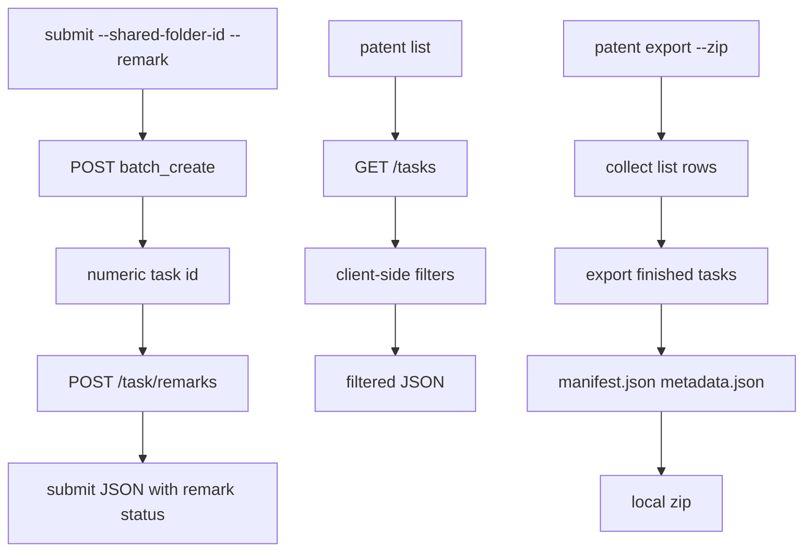

# V2.26 PatSight CLI 二期开发说明

## 一、Swagger 更新结论

接口来源：`http://10.254.51.19:9900/api/openapi/swagger#/`，实际 spec 为 `/api/apispec.json`。

本次复核发现 dev Swagger 已从一期时的接口集合扩展为 18 个 path，新增与增强点如下：

| 类型 | 接口 / 字段 | 二期处理 |
|---|---|---|
| 新增接口 | `POST /api/v2/extractor/task/remarks` | 支持设置或清除单篇专利备注 |
| 响应增强 | `GET /api/v2/extractor/tasks` 返回 `remarks`、`creator`、`folders[]`、`added_by` | 支持本地筛选与批量 zip manifest 元数据 |
| 仍未提供 | 服务端 zip、完整 access log、来源账号/历史记录写入 | CLI 侧采用本地 zip 组装；完整流水与结构化历史导入暂不闭环 |

## 二、二期开发范围

| 能力 | 命令 | 说明 |
|---|---|---|
| 修复提交缓存 | `submit` | 缓存键增加 `folder_id`，避免个人目录与共享文件夹提交互相覆盖 |
| 提交后写备注 | `submit --remark` | 先创建任务，再调用 `POST /task/remarks` 绑定备注 |
| 独立备注管理 | `patent remark set --task-id <id> --remark <text>` | `--remark` 为空或省略时清除备注 |
| 客户端筛选 | `patent list --remark/--creator-email/--unfiled/--multi-folder --fetch-all` | 基于 `tasks` 响应字段本地过滤 |
| 本地 zip 导出 | `patent export --zip ...` | 后端不返回批量 zip；CLI 先列表查询，再导出已完成 task，生成本地 zip、`manifest.json` 与 `metadata.json` |

## 三、不做项

| 项目 | 原因 |
|---|---|
| 来源账号/历史记录导入 | Swagger 仍无写入或导入接口 |
| `access-log list/export` | Swagger 仍无完整操作流水接口 |
| 服务端批量 zip | Swagger 仍无服务端 zip 导出接口 |
| 服务端高级筛选 | `GET /tasks` query 未新增 `remark`、`creator-email`、`unfiled`、`multi-folder` |
| `--last-operator` 筛选 | 当前列表接口未提供稳定最后操作人字段，暂不做筛选闭环 |

## 四、数据流



## 五、命令示例

```powershell
patsight-cli submit --pdf-path WO2010111432A1.pdf --shared-folder-id 27463 --remark "Priority review"

patsight-cli patent remark set --task-id 2069693492657004544 --remark "Priority review"
patsight-cli patent remark set --task-id 2069693492657004544

patsight-cli patent list --remark "Priority" --fetch-all
patsight-cli patent list --creator-email "qingnan.xie@xtalpi.com" --fetch-all
patsight-cli patent list --unfiled --fetch-all
patsight-cli patent list --multi-folder --fetch-all

patsight-cli patent export --zip --folder-id 27463 --fetch-all -o phase2_export.zip
```

## 六、实现文件

| 文件 | 改动 |
|---|---|
| `src/patsight_cli/submit_cache.py` | 缓存键与命中校验增加 `folder_id` |
| `src/patsight_cli/clients/patsight.py` | 新增 `set_patent_remark()` |
| `src/patsight_cli/cli/main.py` | 新增 `submit --remark`、`patent remark set`、`patent export --zip`、list 客户端筛选参数 |
| `src/patsight_cli/patent_filters.py` | 新增专利列表客户端筛选纯函数 |
| `src/patsight_cli/export/batch_zip.py` | 新增本地 zip 批量导出实现 |
| `scripts/run_v226_phase2_flow_test.py` | 新增测试环境串联 E2E 脚本 |

## 七、测试范围

离线自动化覆盖：

| 测试文件 | 覆盖点 |
|---|---|
| `tests/test_submit_cache.py` | `folder_id` 参与缓存键与命中判断 |
| `tests/test_patent_remark_cli.py` | remarks API contract、submit 串联写备注、parser |
| `tests/test_patent_filters.py` | remark、creator、unfiled、multi-folder 客户端过滤 |
| `tests/test_patent_export_zip.py` | zip manifest、metadata、已完成任务导出、未完成任务跳过 |
| `tests/test_shared_folder_cli.py` | 一期共享文件夹和专利命令回归 |

串联 E2E 由 `scripts/run_v226_phase2_flow_test.py` 生成 evidence；最终验收以 `docs/V2.26_CLI_DEV_TOTAL_REPORT.md` 为准。
