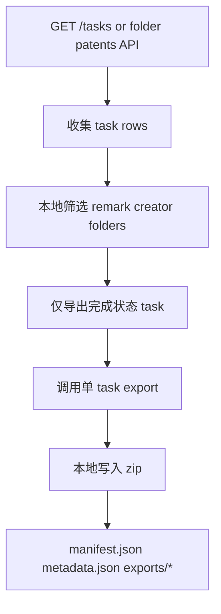

# V2.26 PatSight CLI 开发总验收报告

## 总结

| 项目 | 结论 |
|---|---|
| 验收口径 | 只关注本地 CLI 开发与测试环境 |
| 需求来源 | `C:\Users\qingnan.xie\Downloads\V2.26  PatSight共享文件夹协同与 CLI 上传_导出需求.md` |
| 覆盖范围 | 共享文件夹协同、CLI 上传、备注、查询、筛选、本地 zip 导出 |
| 最新测试证据 | `evidence/v226_phase2_flow_20260625_133415/` |
| 总体结果 | CLI 必须主链路已实现；最后操作时间/操作人筛选仍缺少可用接口字段，不能闭环 |

本报告只按需求文档中的 CLI 必须需求验收，不再按“一期 / 二期”拆分结论，也不把非测试环境状态作为判断依据。后端没有提供服务端批量 zip，CLI 当前采用本地方案：先通过列表接口拿到 task 数据，再对可导出的已完成 task 调用单任务导出，最后在本地生成 zip、`manifest.json` 和 `metadata.json`。

## 必须需求对齐

| 必须需求 | CLI 实现 | 验收结果 | 说明 |
|---|---|---|---|
| 创建共享文件夹、成员协同、把专利加入共享文件夹 | `shared-folder list/create/rename/delete`、`shared-folder members *`、`shared-folder patents list/add/remove` | 部分通过 | 本地契约与命令解析已覆盖；共享文件夹生命周期、专利 add/remove 已在串联流验证；成员命令依赖测试环境成员接口继续联调 |
| CLI 上传专利，支持备注，支持直接进入指定共享文件夹 | `submit --pdf-path ... --shared-folder-id ... --remark ...` | 通过 | 缓存键已包含 `folder_id`；备注失败会使命令失败，避免自动化误判 |
| 未指定共享文件夹时进入个人专利列表，不自动共享 | `submit --pdf-path ...` | 通过 | E2E 先 personal seed，再 shared same pages，验证二者 `folder_id` 不互相污染 |
| 查询当前账号可访问的全部专利 | `patent list --fetch-all` | 已实现，测试数据有限 | CLI 已支持分页拉取；测试环境当前 list 数据不稳定，不能仅靠 E2E 证明所有业务数据完整 |
| 查询某个共享文件夹下的专利 | `shared-folder patents list --folder-id ...`、`patent list --folder-id ...` | 部分通过 | `shared-folder patents list` 已验证；`patent list --folder-id` 在测试环境 list 数据中仍可能返回空 |
| 按标题/专利号、创建者邮箱、备注筛选 | `--name/--name-field`、`--creator-email`、`--remark` | 部分通过 | 标题/专利号沿用后端 `name/name_field`；创建者和备注基于列表响应本地筛选，必须配合 `--fetch-all` |
| 按共享文件夹状态筛选：指定文件夹、多文件夹、未加入文件夹 | `--folder-id`、`--multi-folder`、`--unfiled` | 部分通过 | 指定文件夹依赖列表接口；多文件夹/未加入文件夹基于 `folders[]` 本地筛选 |
| 按最后操作时间、最后操作人筛选 | 暂未闭环 | 未通过 | 当前可用列表/导出接口没有稳定提供最后操作时间和最后操作人筛选字段；zip metadata 仅 best-effort 保留 `updated_time/finished_time/editors` |
| 导出压缩包到本地，内容尽量保持旧导出格式 | `patent export --zip ... -o out.zip` | 通过 | CLI 本地组装 zip；后端不返回批量 zip |

## 复现前准备

- 在仓库根目录执行 `pip install -e .`，确保 `patsight-cli` 可用。
- 测试环境配置写入仓库根目录 `.env`，或通过 `--account` / `--password` 传入。
- 示例 PDF：`WO2010111432A1.pdf`（放在仓库根目录）。
- 下文 `<folder_id>` 示例为测试环境 `3188`（Project A），以 `shared-folder list` 实际返回为准。

## 命令行

以下命令可直接在测试环境复现 V2.26 CLI 必须能力；密码统一写为 `<password>`。

### 共享文件夹协同

| 命令 | 功能说明 |
|---|---|
| `patsight-cli shared-folder list --account qingnan.xie@xtalpi.com --password <password>` | 列出当前账号可访问的共享文件夹树 |
| `patsight-cli shared-folder create --name cli-demo-folder --account qingnan.xie@xtalpi.com --password <password>` | 创建一级共享文件夹 |
| `patsight-cli shared-folder rename --folder-id <folder_id> --name cli-demo-renamed --account qingnan.xie@xtalpi.com --password <password>` | 重命名共享文件夹 |
| `patsight-cli shared-folder delete --folder-id <folder_id> --account qingnan.xie@xtalpi.com --password <password>` | 删除共享文件夹 |
| `patsight-cli shared-folder members list --folder-id <folder_id> --account qingnan.xie@xtalpi.com --password <password>` | 查看一级共享文件夹成员（依赖测试环境 members 接口） |
| `patsight-cli shared-folder members add --folder-id <folder_id> --email member@example.com --role member --account qingnan.xie@xtalpi.com --password <password>` | 添加成员 |
| `patsight-cli shared-folder patents list --folder-id <folder_id> --account qingnan.xie@xtalpi.com --password <password>` | 查看共享文件夹内专利列表 |
| `patsight-cli shared-folder patents add --folder-id <folder_id> --task-id <task_id> --account qingnan.xie@xtalpi.com --password <password>` | 将已有专利加入共享文件夹 |
| `patsight-cli shared-folder patents remove --folder-id <folder_id> --task-id <task_id> --account qingnan.xie@xtalpi.com --password <password>` | 将专利从共享文件夹移出 |

### CLI 上传与备注

| 命令 | 功能说明 |
|---|---|
| `patsight-cli submit --pdf-path WO2010111432A1.pdf --pages 21-22 --account qingnan.xie@xtalpi.com --password <password>` | 上传到个人专利列表，不自动进入共享文件夹 |
| `patsight-cli submit --pdf-path WO2010111432A1.pdf --shared-folder-id <folder_id> --pages 21-22 --account qingnan.xie@xtalpi.com --password <password>` | 上传并直接提交到指定共享文件夹 |
| `patsight-cli submit --pdf-path WO2010111432A1.pdf --shared-folder-id <folder_id> --pages 21-22 --remark "Priority review" --account qingnan.xie@xtalpi.com --password <password>` | 上传时同时写入专利备注 |
| `patsight-cli patent remark set --task-id <task_id> --remark "Priority review" --account qingnan.xie@xtalpi.com --password <password>` | 单独设置或更新专利备注 |
| `patsight-cli status --job-id <task_id> --folder-id <folder_id> --account qingnan.xie@xtalpi.com --password <password>` | 回读任务状态，验证备注是否写入 |

### 专利查询与筛选

| 命令 | 功能说明 |
|---|---|
| `patsight-cli patent list --fetch-all --per-page 20 --account qingnan.xie@xtalpi.com --password <password>` | 查询当前账号可访问的全部专利（分页拉全量） |
| `patsight-cli patent list --folder-id <folder_id> --fetch-all --per-page 20 --account qingnan.xie@xtalpi.com --password <password>` | 按共享文件夹维度查询专利 |
| `patsight-cli patent list --name demo --name-field title --fetch-all --account qingnan.xie@xtalpi.com --password <password>` | 按标题/专利号关键字筛选 |
| `patsight-cli patent list --creator-email qingnan.xie@xtalpi.com --fetch-all --account qingnan.xie@xtalpi.com --password <password>` | 按创建者邮箱筛选（客户端过滤，须 `--fetch-all`） |
| `patsight-cli patent list --remark "Priority review" --fetch-all --account qingnan.xie@xtalpi.com --password <password>` | 按备注关键字筛选（客户端过滤，须 `--fetch-all`） |
| `patsight-cli patent list --unfiled --fetch-all --account qingnan.xie@xtalpi.com --password <password>` | 筛选未加入任何共享文件夹的专利 |
| `patsight-cli patent list --multi-folder --fetch-all --account qingnan.xie@xtalpi.com --password <password>` | 筛选属于多个共享文件夹的专利 |
| `patsight-cli patent detail --task-id <task_id> --account qingnan.xie@xtalpi.com --password <password>` | 查看单篇专利详情 |

### 本地 zip 导出

| 命令 | 功能说明 |
|---|---|
| `patsight-cli patent export --zip --folder-id <folder_id> --fetch-all --no-editors -o export.zip --account qingnan.xie@xtalpi.com --password <password>` | 按共享文件夹导出：CLI 先调列表接口收集 task，再对已完成 task 单条导出，本地打包 zip |
| `patsight-cli patent export --zip --remark "Priority review" --fetch-all -o export.zip --account qingnan.xie@xtalpi.com --password <password>` | 按筛选结果导出 zip（备注筛选须 `--fetch-all`） |

## 结果

以下为测试环境实测结果（证据：`evidence/v226_phase2_flow_20260625_133415/`）。格式：**命令 → 结果 → 说明**。

| 命令 | 结果 | 说明 |
|---|---|---|
| `shared-folder list` | PASS | 返回共享文件夹树，可解析出 `<folder_id>=3188` |
| `shared-folder create / rename / delete` | PASS | 生命周期全链路通过（证据：`evidence/v226_flow_20260625_133048/`） |
| `shared-folder patents list / add / remove` | PASS | 提交后可见 task，remove/add 后列表同步变化 |
| `shared-folder members list` | 待联调 | 命令已实现；测试环境 members 接口需继续验证 |
| `submit --pdf-path ... --pages 21-22`（无 shared-folder-id） | PASS | 个人目录提交，`folder_id=0` |
| `submit ... --shared-folder-id 3188 --pages 21-22` | PASS | 同 PDF/pages 提交到共享文件夹，`folder_id=3188`，缓存未污染 |
| `submit ... --remark "..."` / `patent remark set` | PASS | 备注写入成功 |
| `status --job-id ... --folder-id 3188` | PASS | 回读 remark 与写入值一致 |
| `patent list --fetch-all` | 部分通过 | CLI 分页逻辑正常；测试环境 list 数据量有限 |
| `patent list --folder-id 3188 --fetch-all` | 部分通过 | 可能返回空，与 `shared-folder patents list` 结果不一致 |
| `patent list --remark ... --fetch-all` | FAIL | list API 未返回刚写入 remark 的 task，客户端无数据可筛 |
| `patent list --creator-email / --unfiled / --multi-folder --fetch-all` | 离线 PASS | 客户端筛选逻辑已由单测覆盖；测试环境 E2E 未逐条重跑 |
| `patent export --zip --folder-id 3188 ... -o phase2.zip` | PASS | 本地 zip 生成成功；本次 `task_count=0`（文件夹内无已完成 task） |
| 最后操作时间 / 最后操作人筛选 | 未实现 | 需求必须项；当前接口无稳定筛选字段，CLI 未提供对应参数 |

## 本地 zip 导出说明

`patent export --zip` 不是等待后端返回 zip。当前 CLI 的实现流程是：



zip 内包含：

| 文件 | 内容 |
|---|---|
| `manifest.json` | task 数量、导出数量、跳过数量、warnings、每条 task 的 metadata |
| `metadata.json` | 专利元数据数组，包含备注、创建者、所属文件夹、时间字段等 |
| `exports/*` | 已完成 task 的单任务导出文件 |

当前 E2E 只证明空结果 zip 能正常生成。有完成任务的真实 zip 内容需在测试环境准备一条 `done` 状态 task 后，用上方 `patent export --zip` 命令补测。

## 开发侧验证（非复现命令）

以下仅用于开发回归，不是给他人复现 CLI 功能的命令：

```powershell
python -m pytest -q
```

最近一次结果：`100 passed in 1.57s`。

## 代码审查结论

| 风险点 | 处理结果 |
|---|---|
| `submit --remark` 失败但命令仍 exit 0 | 已修复为 `ClientError`，自动化可感知失败 |
| payload 模式静默忽略 `--pages/--folder-id/--job-type` | 已新增冲突校验 |
| 客户端筛选只过滤当前页 | 已要求 `--fetch-all`，否则直接报错 |
| submit cache 未区分个人目录和共享文件夹 | 已将 `folder_id` 纳入缓存键与命中校验 |

## 未闭环项

1. 最后操作时间、最后操作人筛选是需求文档必须项，但当前 CLI 只能保留已有响应字段，缺少稳定列表字段或查询接口支撑，尚未闭环。
2. 测试环境 `patent list --remark --fetch-all` 没有返回刚写入 remark 的 task，导致筛选 E2E 不能证明端到端成功。
3. 当前真实 E2E 的 zip 为 `task_count=0`，有完成任务的真实 zip 内容仍需要测试环境准备一条 finished task 后补测。
