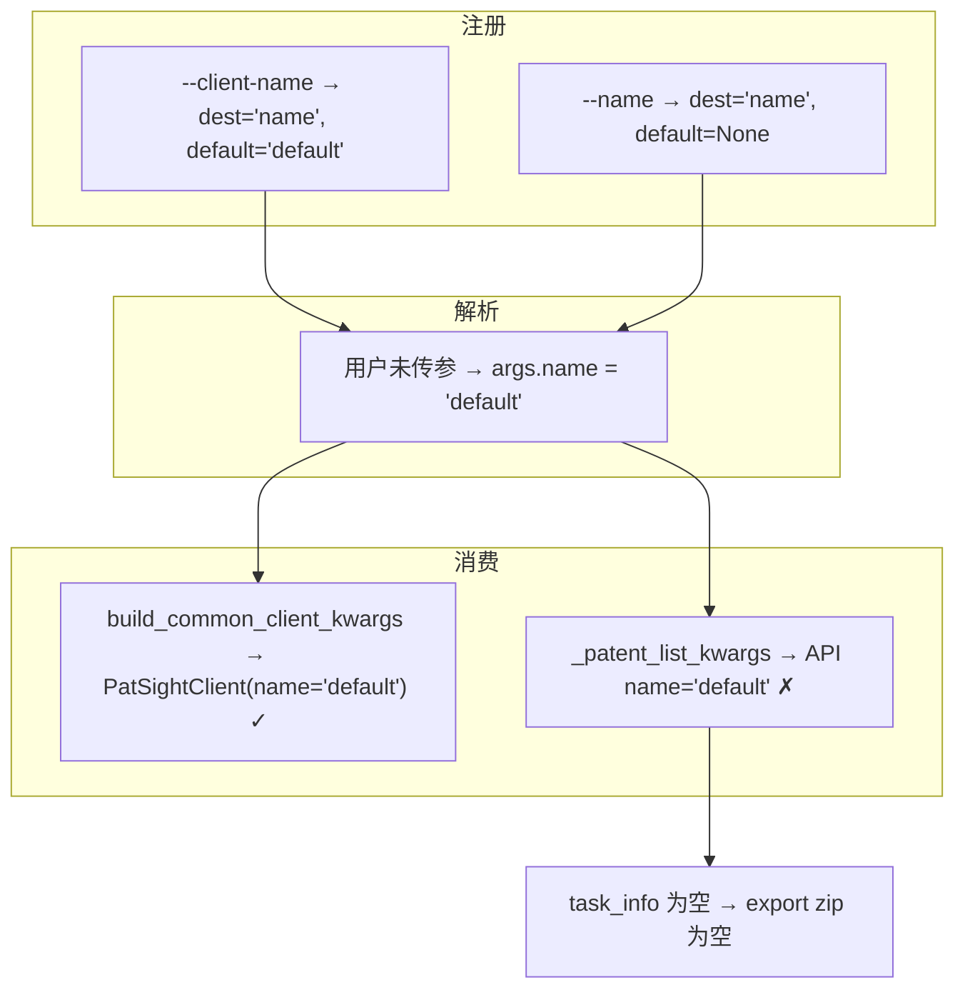

# Bug 记录：patent list / export 误传 `name=default` 导致列表为空

## 基本信息

| 项 | 内容 |
|---|---|
| 发现日期 | 2026-07-02 |
| 影响范围 | `patsight-cli patent list`、`patsight-cli patent export --zip` |
| 严重级别 | P0（功能不可用） |
| 状态 | 已修复 |
| 关联文档 | [PATENT_EXPORT_EMPTY_ROOT_CAUSE_SOLUTION.md](./PATENT_EXPORT_EMPTY_ROOT_CAUSE_SOLUTION.md) |

## 现象

用户执行：

```powershell
patsight-cli patent list --fetch-all
patsight-cli patent export --zip --fetch-all --no-editors -o export-all.zip
```

返回：

```json
{
  "code": 1,
  "data": {
    "count": 0,
    "task_info": [],
    "fetched_all": true
  }
}
```

导出 zip 仅包含空的 `manifest.json` / `metadata.json`，`task_count=0`。

同时，`shared-folder patents list --folder-id 3188` 能返回 6 条任务，容易误判为「后端列表接口无数据」。

## 根因

**CLI 参数命名冲突：`--client-name` 与 `--name` 共用 `dest="name"`，导致专利列表请求默认携带 `name=default`。**

---

## 参数冲突详解

### `dest="name"` 是什么

`dest` 是 Python `argparse` 的参数：**命令行解析后，值存到 `args` 的哪个属性**。

```python
p.add_argument("--client-name", dest="name", default="default")
```

含义：

- 用户在命令行输入 `--client-name`
- 解析后写入 **`args.name`**
- 不传时默认 **`"default"`**

命令行名字（`--client-name`）和代码里访问的名字（`args.name`）可以不同，靠 `dest` 映射。

---

### 写法 1：客户端实例名（CLI 基础设施）

```python
# add_client_flags() 内
p.add_argument(client_name_flag, dest="name", default="default",
               help="Client instance name (token key suffix)")
```

在 `patent list` 中 `client_name_flag="--client-name"`，等价于：

```python
p.add_argument("--client-name", dest="name", default="default", ...)
```

| 项 | 说明 |
|---|---|
| 层级 | CLI 基础设施，不是专利业务筛选 |
| 命令行 | `--client-name ProjectA` |
| 存入 | `args.name` |
| 默认值 | `"default"` |
| 用途 1 | 创建 `PatSightClient(name=...)` |
| 用途 2 | SQLite token 缓存 key：`patsight:default` / `patsight:ProjectA` |

消费路径：

```python
# build_common_client_kwargs()
"name": getattr(args, "name", None)  # → PatSightClient(name="default")
```

设计意图：**区分多套 CLI 客户端配置 / 哪把 token**，大多数用户不传时用 `"default"`。

---

### 写法 2：专利关键字筛选（业务参数）

```python
# patent list / patent export 内
p_patent_list.add_argument("--name", default=None, help="Keyword filter")
```

| 项 | 说明 |
|---|---|
| 层级 | 专利列表业务筛选 |
| 命令行 | `--name WO2010` |
| 未写 `dest` | argparse 默认 `dest="name"` |
| 默认值 | `None`（不按名称筛选） |
| 用途 | 传给后端 `GET /tasks?name=...` |

消费路径：

```python
# _patent_list_kwargs()
"name": args.name,  # → list_accessible_patents(name=...)
```

设计意图：**按专利标题/文件名等关键字过滤列表**，用户不传时不应带 `name` 参数。

---

### 注册顺序（`patent list`）

```python
p_patent_list = patent_sub.add_parser("list", ...)

# 第 1 步：通用客户端参数（含 --client-name → dest="name"）
add_client_flags(p_patent_list, client_name_flag="--client-name")

# 第 2 步：专利列表参数（含 --name → 默认也是 dest="name"）
p_patent_list.add_argument("--name", default=None, help="Keyword filter")
```

两个参数注册到**同一个 parser**，且**都映射到 `args.name`**。

---

### 两个参数的本意对比

| | 写法 1 `--client-name` | 写法 2 `--name` |
|---|---|---|
| 语义 | 用哪套 CLI 客户端 / token | 搜什么关键字的专利 |
| 类比 | 「用哪个账号配置连服务器」 | 「按标题关键字筛专利」 |
| 应传给 | `PatSightClient(name=...)` | `list_accessible_patents(name=...)` |
| 应使用属性 | `args.client_name` | `args.name` |
| 默认值 | `"default"` | `None`（不筛选） |
| 不传时期望 | 用 default 实例 | **不传 name 给 API** |

---

### argparse 冲突行为

相同写法实测：

```python
p.add_argument("--client-name", dest="name", default="default")
p.add_argument("--name", default=None)
```

| 用户输入 | `args.name` | 后果 |
|---------|------------|------|
| 什么都不传 | `"default"` | **列表误传 `name=default`，主 bug** |
| `--name demo` | `"demo"` | 列表按 demo 筛；client 可能用 `patsight:demo` token（次 bug） |
| `--client-name ProjectA` | `"ProjectA"` | 列表误传 `name=ProjectA` |
| 两个都传 | `"demo"` | 后注册的 `--name` 覆盖 |

#### 情况 A（最常见）：用户未传任何 name 相关参数

```powershell
patsight-cli patent list --fetch-all
```

- 用户意图：列出全部专利，不按名称筛选
- 实际：`args.name == "default"`
- HTTP：`GET /tasks?page=1&per_page=100&name=default`
- 结果：后端按关键字 `"default"` 搜索 → 0 条

#### 情况 B：用户传 `--name demo` 搜专利

```powershell
patsight-cli patent list --name demo
```

- 列表筛选可能正常（`name=demo`）
- 但 `build_common_client_kwargs` 也用 `args.name` → token key 变成 `patsight:demo`
- 可能用错 token / 登录失败（潜在次 bug）

#### 情况 C：用户传 `--client-name ProjectA`

```powershell
patsight-cli patent list --client-name ProjectA
```

- client 用 `patsight:ProjectA` token（可能正确）
- 列表误传 `name=ProjectA`（错误）

---

### 数据流：一处对、一处错



Client 创建行为正确；**列表 API 多传了错误的 `name` 参数**。

---

### 为何 `shared-folder patents list` 不受影响

该命令只有写法 1，没有 `--name` 筛选：

```python
add_client_flags(p_patents_list, client_name_flag="--client-name")
# 无 p.add_argument("--name", ...)
```

`args.name == "default"` 仅用于 client，**不会**传给列表 API → 能正常返回数据。

---

### 实际 HTTP 请求（verbose 证实）

```text
GET /patent/api/v2/extractor/tasks?page=1&per_page=100&name=default
```

后端将 `name` 当作专利标题/名称关键字，无匹配 → 空 `task_info`。

---

## 证据链

| 验证方式 | 请求参数 | 结果 |
|---------|---------|------|
| `patsight-cli patent list --fetch-all` | 含 `name=default` | count=0 |
| `patsight-cli --verbose patent list --fetch-all` | 日志可见 `name=default` | count=0 |
| curl 脚本直调 `/v2/extractor/tasks` | 仅 `page=1&per_page=100` | count=15 |
| Python `PatSightClient().list_accessible_patents(...)` | 无 `name` 参数 | count=15 |
| `shared-folder patents list --folder-id 3188` | 走 folder 接口 | 6 条 |

结论：**接口有数据，CLI 因参数 bug 把列表筛空。**

## 影响命令

| 命令 | 是否受影响 | 说明 |
|------|-----------|------|
| `patent list` | 是 | 默认空列表 |
| `patent list --fetch-all` | 是 | 同上 |
| `patent export --zip` | 是 | 依赖 list 收集 task，导出空 zip |
| `patent export --zip --fetch-all` | 是 | 同上 |
| `shared-folder patents list` | 否 | 无 `--name` 业务参数，不走误传 |
| `export --job-id <id>` | 否 | 单条导出，不依赖列表 |

## 复现步骤

1. 配置 `.env` 指向测试环境（如 `PATSIGHT_URL=https://patsight-app-test-hk.xinsight-ai.com`）。
2. 确保账号下存在专利 task（curl 或 Python 直调可验证有 15 条）。
3. 执行：

   ```powershell
   patsight-cli --verbose patent list --fetch-all --per-page 100
   ```

4. 观察 debug 日志中出现 `name=default`。
5. 返回 `count: 0`。

## 为何 curl / Python 正常而 CLI 异常

| 对比项 | CLI | curl / Python |
|--------|-----|---------------|
| 是否传 `name` | 是，`name=default` | 否 |
| 环境 | test-hk（`.env`） | 同左 |
| Token | SQLite 缓存 | 同左 |
| 结果 | 0 条 | 15 条 |

差异仅在 CLI 多传了错误的 `name` 参数。

## 次要问题（非本次主因）

### 1. 两套列表接口语义不一致

| 接口 | 方法 | 路径 |
|------|------|------|
| 通用列表 | GET | `/v2/extractor/tasks` |
| 共享文件夹成员 | POST | `/v2/extractor/task/folder/task/get` |

`patent list --folder-id` 与 `shared-folder patents list` 在部分场景返回不一致。修复 `name=default` 后，folder 场景仍可能需要 export 兜底逻辑。

### 2. 分页越界返回 404

总记录 15 条、`per_page=100` 时，请求 `page=2` 后端 `paginate()` 触发 404，而非 `200 + 空列表`。CLI 有 count 判断通常不会请求第 2 页；测试脚本需注意。

### 3. Swagger dev 环境 500

Swagger `10.254.51.19:9900` 与 CLI 使用的 `patsight-app-test-hk` 非同一环境，500 与本次 CLI bug 无直接关系。

## 修复建议

### P0：修复 CLI 参数冲突

**目标：客户端实例名与专利关键字筛选使用不同 `dest`。**

```python
# 修改前
p.add_argument("--client-name", dest="name", default="default")
p.add_argument("--name", default=None)

# 修改后
p.add_argument("--client-name", dest="client_name", default="default")
p.add_argument("--name", dest="patent_name", default=None)  # 或保留 dest="name" 但 client 改用 client_name
```

具体步骤：

1. `add_client_flags()` 中 `--client-name` 的 `dest` 改为 `client_name`。
2. `build_common_client_kwargs()` 使用 `getattr(args, "client_name", "default")`。
3. `_patent_list_kwargs()` 使用 `getattr(args, "patent_name", None)` 或独立的 `args.name`（仅 patent 命令独占）。
4. 补充单测：未传 `--name` 时，`list_accessible_patents` 调用参数中**不含** `name` 字段。

### P1：export 共享文件夹兜底（可选）

指定 `--folder-id` 且 `/tasks` 为空时，兜底调用 `list_shared_folder_patents()`。详见 [PATENT_EXPORT_EMPTY_ROOT_CAUSE_SOLUTION.md](./PATENT_EXPORT_EMPTY_ROOT_CAUSE_SOLUTION.md)。

### P2：后端改进（可选）

- 分页越界返回空列表而非 404。
- 对齐 `/tasks?folder_id=` 与 `folder/task/get` 语义。

## 修复后验证

```powershell
# 1. 列表应返回数据
patsight-cli --verbose patent list --fetch-all --per-page 100
# 预期：日志中无 name=default，count > 0

# 2. 导出应有内容
patsight-cli patent export --zip --fetch-all --no-editors -o export-all.zip
# 预期：task_count > 0，zip 含 exports/*

# 3. 单测
pytest tests/test_patent_export_zip.py tests/test_shared_folder_cli.py -q
```

## 涉及文件

| 文件 | 说明 |
|------|------|
| `src/patsight_cli/cli/main.py` | `add_client_flags()`、`--name` 冲突、`_patent_list_kwargs()`、`build_common_client_kwargs()` |
| `src/patsight_cli/export/batch_zip.py` | export 依赖 list 收集 task |
| `scripts/curl_patent_list_fetch_all.ps1` | 直调接口对比验证脚本 |
| `docs/PATENT_EXPORT_EMPTY_ROOT_CAUSE_SOLUTION.md` | 空 zip 根因与方案（含 folder 兜底） |

## 临时规避

在 CLI 修复前，**不要用 `patsight-cli patent list` 判断接口是否有数据**。

可用：

```powershell
# 直调接口（不传 name=default）
powershell -ExecutionPolicy Bypass -File .\scripts\curl_patent_list_fetch_all.ps1

# 或查共享文件夹
patsight-cli shared-folder patents list --folder-id 3188

# 或单条导出
patsight-cli export --job-id <task_id>
```

## 结论

- **写法 1** `--client-name` + `dest="name"` + `default="default"`：指定 CLI 客户端实例 / token，默认 `"default"`。
- **写法 2** `--name` + `default=None`：专利标题关键字筛选，默认不筛选。
- **冲突**：两者共用 `args.name`；用户不传参时恒为 `"default"`，被误传给列表 API。

**空列表、空 zip 的主因是 CLI 将客户端实例名 `default` 误当作专利关键字 `name=default` 传给后端。** 修复参数冲突后，`patent list` 与 `patent export --zip` 在测试环境应能正常拿到数据（当前账号约 15 条 task）。
